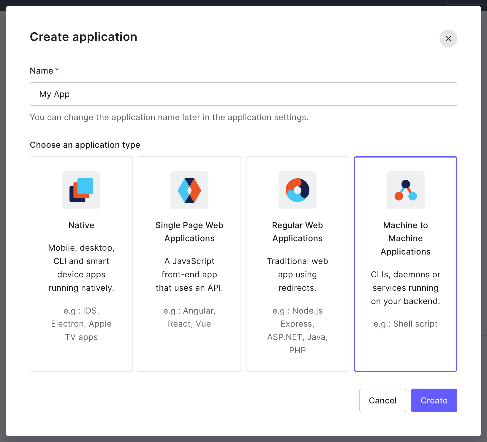
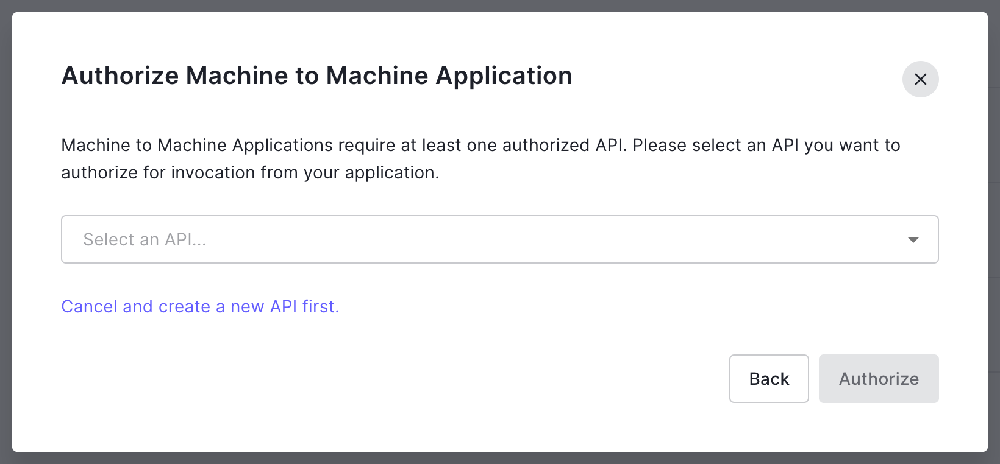
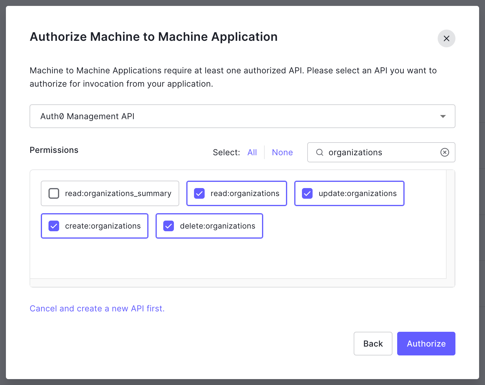
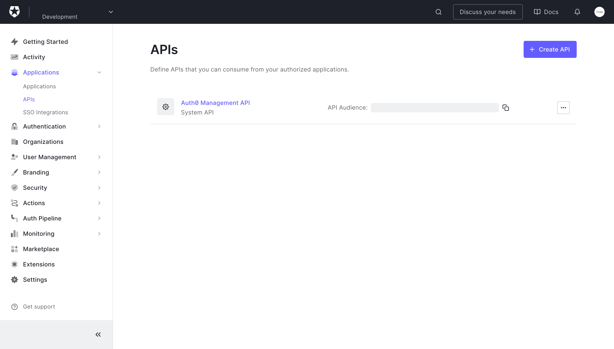

# sync-from-the-institutions-to-auth0-organizations

## `sync`

Syncronises THE Institutions to Auth0 Organizations. This application is expected to run _forever_

It gets the Institutions reference data from THE to create, update, or remove matching Organizations in Auth0 before _napping_ and repeating

You may use either a [manual or programmatic access token](https://auth0.com/docs/secure/tokens/access-tokens/management-api-access-tokens)

You can create a _manual token with a lifetime (in seconds)_ but once it has expired you must create another token, and stop and start this application to apply it

A [programmatic token requires more configuration](https://auth0.com/docs/secure/tokens/access-tokens/get-management-api-access-tokens-for-production) but when the token expires _this application_ can request another token, over the network, without interruption

### 1. Create a "Machine to Machine" application in Auth0

Enter a _Name_, click to select _Machine to Machine Applications_ and click _Create_



### 2. Authorise the application for the Management API

Select _Management API_ and click _Authorize_



### 3. Authorise the application with permsissions

Filter by _organizations_ and click to select each of `read:organizations` `update:organizations` `create:organizations` `delete:organizations` then click _Authorize_



### 4. Application details

The next page shows the details of your application

On the _Settings_ tab, under _Basic Information_ (at the top of the page) you can confirm the _Name_ and find its _Domain_, _Client ID_, and _Client Secret_

On the _APIs_ tab, you can find its API identifier

You will need some of these values when starting _this application_ with a manual token (for instance, in development)

You will need all of these values when starting _this application_ with a programmatic token (in production)

### Starting with a manual token

You need only the _Domain_ of your Auth0 account and a manual _Access Token_

With NPM

```bash
npm run sync -- \
  --AUTH0_DOMAIN '<AUTH0 DOMAIN>' \
  --AUTH0_ACCESS_TOKEN '<AUTH0 MANUAL ACCESS TOKEN>' \
  --NAP 1800000
```

Otherwise

```bash
./scripts/sync.mjs \
  --AUTH0_DOMAIN '<AUTH0 DOMAIN>' \
  --AUTH0_ACCESS_TOKEN '<AUTH0 MANUAL ACCESS TOKEN>' \
  --NAP 1800000
```

### Starting with a programmatic token

You need

- The _Domain_ of your Auth0 account
- The _Client ID_ of your machine to machine application
- Its _Client Secret_
- The _Audience_, which is the API identifier
- The _URL_ of the Management API exposed on your _Domain_

For both of these values log in to the [Auth0 management dashboard](https://manage.auth0.com/). Under _Applications_, then _APIs_, find a link to the _Auth0 Management API_



Here you will find the _Audience_ value which you can copy to your clipboard (in the image it is redacted)

Click through to the _Auth0 Management API_ page and on the _Test_ tab (at the top), under _Asking Auth0 for tokens from my application_ you will find some example code for different tools

Under _CURL_ find the _URL_

```bash
--url https://<AUTH0 DOMAIN>.uk.auth0.com/oauth/token \
```

(where `<AUTH0 DOMAIN>` is your _Domain_)

Copy that URL (only the URL, including the `https` part, but not including any of the Bash)

In review

- The _Domain_ is the `AUTH0_DOMAIN`
- The _Client ID_ is the `AUTH0_CLIENT_ID`
- The _Client Secret_ is the `AUTH0_CLIENT_SECRET`
- The _Audience_ is the `AUTH0_AUDIENCE`
- The _URL_ is the `AUTH0_ACCESS_TOKEN_ENDPOINT`

With NPM

```bash
npm run sync -- \
  --AUTH0_DOMAIN '<AUTH0 DOMAIN>' \
  --AUTH0_CLIENT_ID '<AUTH0 CLIENT ID>' \
  --AUTH0_CLIENT_SECRET '<AUTH0 CLIENT SECRET>' \
  --AUTH0_AUDIENCE '<AUTH0 AUDIENCE>' \
  --AUTH0_ACCESS_TOKEN_ENDPOINT '<AUTH0 RESOURCE>' \
  --NAP 1800000
```

Otherwise

```bash
./scripts/sync.mjs \
  --AUTH0_DOMAIN '<AUTH0 DOMAIN>' \
  --AUTH0_CLIENT_ID '<AUTH0 CLIENT ID>' \
  --AUTH0_CLIENT_SECRET '<AUTH0 CLIENT SECRET>' \
  --AUTH0_AUDIENCE '<AUTH0 AUDIENCE>' \
  --AUTH0_ACCESS_TOKEN_ENDPOINT '<AUTH0 RESOURCE>' \
  --NAP 1800000
```
